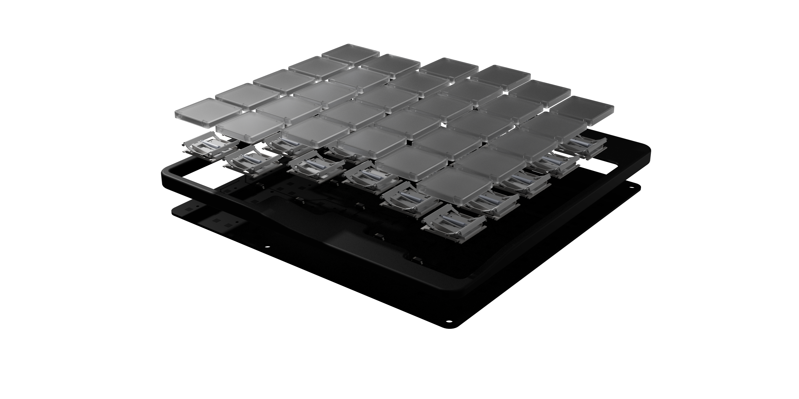
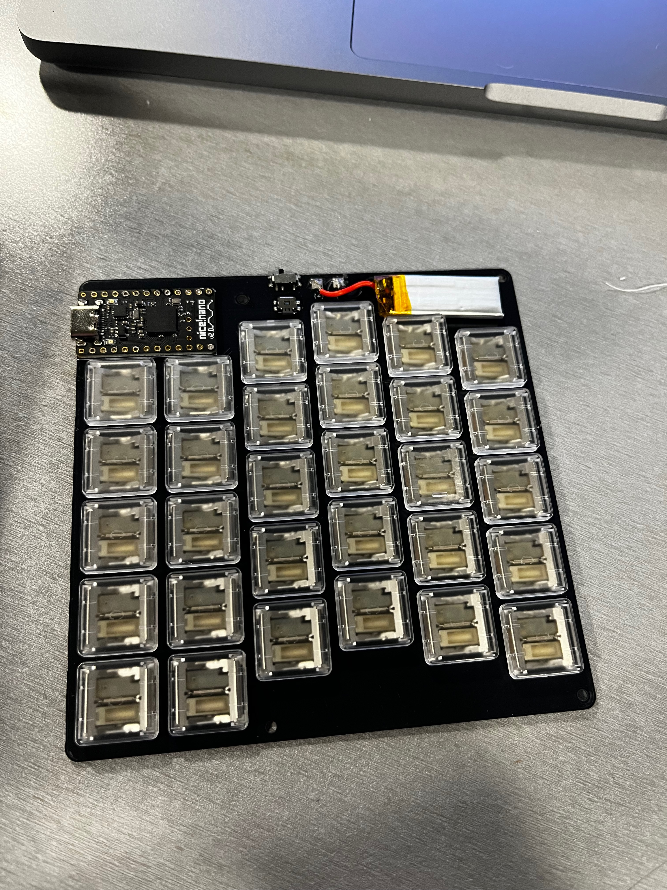
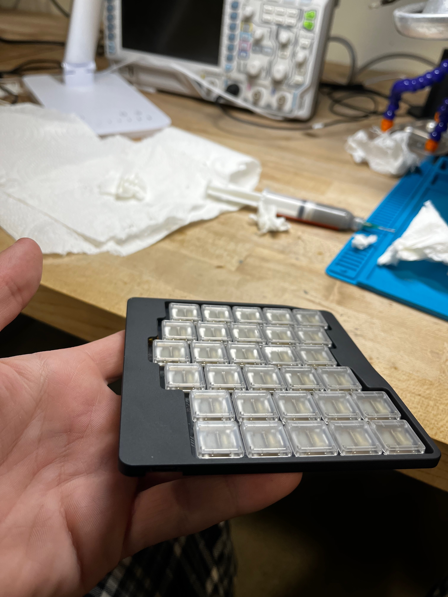
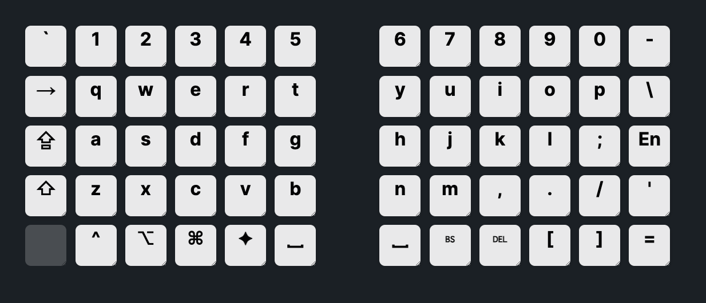
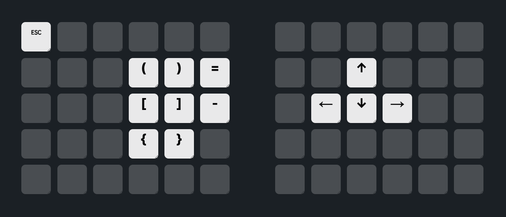

# 
BK-1

### 
By Asa Gilmore

  

Before I get into the project I want to give credit to the two projects which inspired
this keyboard, both the [Mikefive](https://github.com/mikeholscher/zmk-config-mikefive),
and the [Caldera](https://github.com/christianselig/caldera-keyboard) keyboards.
Please go check out both of their projects as they are both really great! 

I started my journey with ergonomic keyboards building Christian Selig's Caldera keyboard. <!-- FIX -->
Switching from a regular keyboard to a split ortholinear keyboard was a huge revelation.
I think Cristian Sellig has found the perfect layout with his keyboard,
but there were a few things about the Caldera keyboard that kept it from being the
perfect keyboard for me. One of the primary issues was the switches. This may
be an unpopular opinion, but I much prefer the feel of a laptop style switch, I
don't like to make my fingers do any more work than they have to, and the binary
feel of a laptop switch makes me much more accurate than a mechanical switch with longer
travel. Also using taller switches without a bulky wrist rest makes your wrist bend
reducing comfort. When I saw the Mikefive with a total height of under 5mm, I knew
I wanted something similar.  

### 
Design

There are some key design ideas that come from how I specifically use my computer
that guided this build. While I totally understand the appeal of a more traditionall
ergonomic keyboard like the Kinesis for someone who writes code all day,
as a data science and machine learning researcher, and a Student, I frequently switch between
input tools during my workflow.
I am often jumping between working with 3d neruoimaging data, cad modeling programs, and alternating
between pen and paper and a writing math in LaTeX.
Because of this I want switching between different input devices to feel
really seamless. I want my keyboard to feel like an invisable interface between
me and my computer, as opposed to the centerpiece of my desk.   
Because the BK-1
sits at the same height as my trackpad, flicking my wrist over to make a mouse input feels
seamless and intuitive. The split design allows me to position the board around a notepad or
any other items on my desk depending on my workflow. The short and snappy
Kalih PG1316S switches feel comfortable and familar coming from my MacBook keyboard.
Overall I think the goal here it to make the keyboard feel like a seamless component
of my overall workflow, as opposed to the de facto to engage with my computer.

### 
Engineering

The design of this keyboard borrows its layout from the Caldera Keyboard, with a slight
change made to the amount of column stagger, most notably, more stagger on the pinky
row. It uses the Kalih PG1316S switches surface mounted on a 0.8mm PCB, with a
unibody aluminum chassis surrounding it. Each half has a Nice!Nano v2 and a 110mah
LiPo battery, resulting in about a week of use between charges. The case is attached
with 4 M.2 screws, one of which has to be the slightly hard to find countersunk M.2 x 2.5mm
screw. JLC PCB and CNC was used to order the parts, as they have absurdly cheap
CNC pricing. The case is definitely a bit overcomplicated, but I really wanted to minimize
the length of the case to keep it a more square aspect ratio. The inside has some
weird cutouts for the battery and overcomplicated screw placement, but it works and
is hidden from the end user!  
Fitting the MCU and battery was a bit of a challenge, but the column stagger allows
for the MCU to fit lower on the left side, and using a small 110mah batter means
that there is not too much of a forehead on the board, though I think there is
room to make improvement in this area. The screw placement is a bit unorthodox,
as I wanted the corners of the case to come up next to the switches without any
padding, but because the boards is small, it still feels super sturdy. The battery just fits
on top of the PCB with some double-sided tape. 
The total cost of this board is ~$250, which is a lot. The cost could be brought down
a lot with a cheaper MCU, bulk ordering of the case + switches.

I used [this](https://www.aliexpress.us/item/3256807350153870.html) cheap hotplate to solder it,
which worked great, although it's a bit small.

  <figure style="margin: 0 10px;">
    
  </figure>
  <figure style="margin: 0 10px;">
    
  </figure>

### 
Keymap

Keymaps are likely something each person will customize for themselves, but I will
share how I like to set up this keyboard. It's pretty straightforward, with a single
mod layer. The mod key is on the left hand, and maps arrow keys to the resting
location of my right hand, and some maps some frequently used coding characters
to the left hand.

  <figure style="flex: 1; text-align: left; margin-right: 10px;">
    
  </figure>
  <figure style="flex: 1; text-align: right;">
    
  </figure>

### 
Avaiabilty

This project is licensed under a CC Non-Commercial Share-Alike license. This
means you are free to use the files to order the parts to build your own free
of charge, and modify it to your liking. You are however not permitted to sell
kits, builds or other parts of this project. 

In the files folder you will find two .STEP files, one including both the case
and the PCB and all of its components and switches. This one is what you should
use if you want to make another case, as you can build around the board. The other
one has just the Case and is what should be used to order the case from a service.

The PCB files should be good to order as is, just make sure you order a 0.8mm
thick board.

The cad files for the case are also straightforward to order, I ordered them from
JLC cnc, with 0.1mm precision. The drawing is needed for tapping the holes as well.

I also have a few extra PCB's due to the minimum order quantity on JLC. If anyone
wants to take them off my hands create an issue on this repo to get in touch with me.

### 
Improvements

* I worked for a while to try to fit a bigger battery into this board, but
  ultimately couldn't find a way to do so without adding a comically big forehead,
  so for now we're stuck with a 110mah battery.
* The keycaps provided by Kalih are flat, A custom keycap that has a subtle dish
  to it would make typing more comfortable. It looks like the mikefive project is
  working on some resin printed keycaps, so hopefully that is an option soon!

### 
Support

If you end up building your own, and you feel like I've earned it, any support would
be greatly appreciated. Feel free to contact me at the email
below if you want to get in touch with me about collaborating to commercialize
this build.  
 

